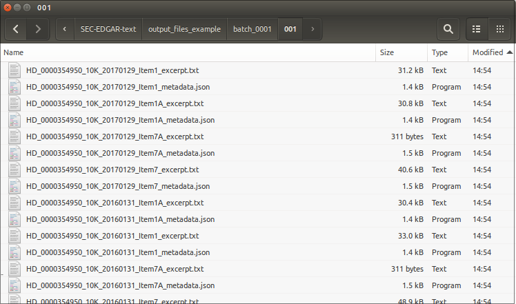

# SEC EDGAR Text
Download company filings from the SEC EDGAR service, and find key text
sections of interest.


Download key text sections of SEC EDGAR company filings. Format, organise
and store the text excerpts ready for both automated processing (NLP) and
for human reading (spot-checking). Structured storage of text and
metadata, with logging of failed document analyses. Suitable for
automation of large-scale downloads, with flexibility to customise
which sections of the documents are extracted. Compatible with all
main EDGAR document formats from 1993 onwards, and easily adapted or
extended to extract different sections of interest in EDGAR filings.

Generally accurate in extracting text, but lots of room for improvement.
Comments and contributions welcome!


#### About the project

* I completed this project during a sabbatical from my job.
* I used [SEC-Edgar-Crawler](https://github.com/rahulrrixe/sec-edgar)
for initial ideas which helped this project.
* Thanks to my colleagues at Rosenberg Equities for help with an earlier
attempt to download EDGAR data.

## Installation


## Usage
Typical usage (default: download the 500 companies in 'companies_list.txt'):

```python secedgartext --storage=/tmp/storage_folder```


## Background
### About EDGAR

*History and future of EDGAR, links to key SEC procedures documents etc.*
Electronic filing was mandatory from 1996.


### Retrieving text data from EDGAR



### Other packages, and academic research
Many specialised projects automate access to EDGAR filings.
Some access text data, like this one. Most focus on downloading whole
filing documents, financial statements information, or parsing
XBRL filings. This package aims to make access to large volumes of text
information easier and more consistent.

https://github.com/datasets/edgar A nice introduction to the EDGAR database
website.

Professor Bill McDonald, with collaborators including Prof Tim Loughran
has led much of the academic reserach into company filings' text
data in recent years. He much shares the approach
that he used for extracting EDGAR filings text data on his
[website](https://www3.nd.edu/~mcdonald/Word_Lists.html).
The approach to scraping the text data is somewhat different to that
used in this project, but it has a similar goal, and the documentation
gives a great introduction to the structure of the HTML filing documents.
The website includes links to related research, and
plenty of guidance on doing downstream research on EDGAR text documents.
